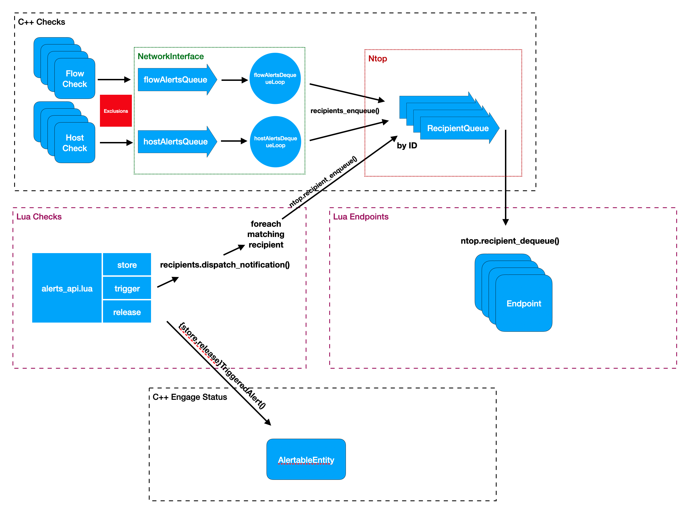

# Alerts Architecture

Alerts in ntopng are triggered from C++ (Flow and Host alerts) or from Lua (all other alert types).
Flow and Host alerts are triggered from C++ for performance reasons, as Lua checks would affect the
performance if every single flow or host has to be evaluated, multiple times during the lifecycle.

The below picture summarizes the interactions between C++ and Lua, and the involved queues.

Note that the database (built-in recipient) is directly connected to one of the recipients queue (the
first one). There is a "alert_store_db" endpoint which is taking care of inserting alerts into the
database (see the alert_store.lua and subclasses). The only exception is with flow alerts when clickhouse 
is enabled: in this case flow alerts are no longer enqueues to the recipient queue for the database, 
as they are a view on the flows table (historical flows stored on clickhouse).

# Stateless vs Stateful

ntopng alerts are stateless or stateful

## Stateless alerts

Stateless alerts are `stored` when an issue is detected. Issues which trigger stateless alerts have no duration associated, that is, they are basically events such as the connection/disconnection of a device, or the change of the status of an SNMP device port.

To store a stateless alert, method `alerts_api.store` is called.

### Stateless alerts lifecycle

1. `alerts_api.store`, through `recipients.dispatch_notification`, enqueues the alert into the ntopng recipients queue (`ntop.recipient_enqueue`)
2. each endpoint, according to its frequency, dequeues alerts from the recipients queue (`ntop.recipient_dequeue`)

## Stateful alerts

Stateful alerts are `trigger`ed when the issue is detected, and are `release`d when the issue no longer occurs. Issues which trigger stateful alerts have a duration associated, that is, they are events such as threshold crosses (e.g., the throughput is above 1Mbps) or suspicious activities (e.g., the host is performing a TCP scan).

Methods `alerts_api.trigger` and `alerts_api.release` are called to trigger and release stateful alerts, respectively.

### Stateful alerts lifecycle

1. `alerts_api.trigger` sets into the C core the triggered alert (e.g., `interface.storeTriggeredAlert`) and enqueues the alert into the ntopng recipients queue (`ntop.recipient_enqueue`).
2. `alerts_api.release` removes from the C core the previously triggered alert (e.g., `interface.releaseTriggeredAlert`), enqueues the alert into the recipients queue (`ntop.recipient_enqueue`).
3. each endpoint dequeues alerts from the recipients queue as described above for stateless alerts.

# Alert Queues

Queues are used to decouple the dispatch from the processing of alerts. 
Currently used queues are:

- In-memory First-level C++ queues for flow (`flowAlertsQueue`) and host (`hostAlertsQueue`) alerts in NetworkInterface. Alerts triggered by C++ checks are enqueues into those queues, and dequeued by two different threads (see `flowAlertsDequeueLoop` and `hostAlertsDequeueLoop`), processed, and enqueued into the recipients queues.
- In-memory Recipients queues (see `RecipientQueue`) which is a set of queue, one per recipients, where each endpoint dequeues alerts for the corresponding recipient and sends out the notification (or insert the alert into the database)

## Queue messages format

JSON messages are queued/dequeued. The format of the JSON is contains variable fields which depends on the alert type. However, a minimum set of fields is constant and include alert type, entity and severity.

## Notifications
Alerts can be sent to external receivers via notifications (Alerts -> Notifications menu).

To check duplicate alerts you can see: `function alert_utils.check_alert_policy` in `scripts/lua/modules/alert_utils.lua`. A new redis key is added for each alert where the key is: `ntopng.cache.alert.retention.{RECIPIENT_ID}.{ENTITY_ID}.{ALERT_ID}{ALERT_KEY}`. ALERT_KEY is built by concatenating srcIP dstIP srcPort dstPort. If the key is set in redis, the alert is not sent for an hour (3600 seconds as defined by the constant at line 929)