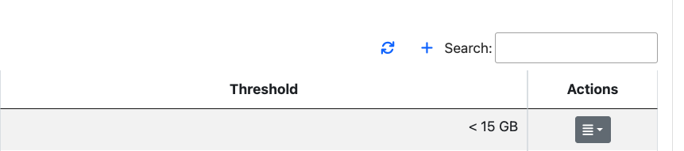

Traffic Rules
=============

ntopng can trigger customizable alerts, based on timeseries. This is useful to identify missbehaviors from devices, interfaces...

.. note::

  This feature is available only from Enterprise M license or superior.

.. figure:: ./../img/traffic_rules.png
  :align: center
  :alt: Configured Traffic Rules

  Configured Traffic Rules

Here some example of rules:
  - The daily traffic of ens160 network interfce does not have to exceed 15 GB in total;
  - The daily traffic of 192.168.2.28 does not have to be less than 2 GB in total;
  - The NTP daily traffic of 192.168.1.1 does not have to exceed 2 GB in total;
  - The 1kxun traffic every 5 minutes of 1.1.1.1 does not have to exceed 15% from the precedent 5 minutes total traffic;
  - The traffic every 5 minutes of 1.1.1.1 does not have to exceed 1 Mbps;

Whenever a condition is met, ntopng is going to trigger an alert.

.. note::
  To page is accessible from the Settings -> Traffic Rules

  
.. figure:: ./../img/traffic_rules_entry.png
  :align: center
  :alt: Access Traffic Rules

  Access Traffic Rules

Available Rules
---------------

The rules can be set for each timeseries currently available in ntopng. The rules can be configured for:

- Flow Exporters;
- Host Pools;
- Interfaces;
- Local Hosts;
- Networks;
- Traffic Profiles;
- VLANs;

Configure Rules
---------------

To add a new rule, click the '+' symbol above the table

  Add a Traffic Rule

At this point, fill the fields with the correct informations:
  - Target: insert the subject (Local Host, Interface, Subnet, ...) to be analyzed or a * , meaning that everyone has to be analyzed (e.g. All Local Hosts);
  - Metric: select the metric to be analyzed (e.g. DNS -> the DNS traffic);
  - Frequency: select the frequency of the analysis (e.g. 5 Min -> analyzed every 5 minutes)
  - Threshold: select the type of threshold (Volume, Throughput or Percentage), lowerbound or upperbound, and the threshold that, if exceeded, is going to trigger an alert
  - Percentage Threshold: is calculcated beetwen the last two frequency checks (e.g. <1% with frequency 5 Min -> if the difference between precedent frequency and the last 5 minutes check is lower than 1% trigger and alert)

.. note::
  The available metrics to be analyzed depend on the available timeseries; this means that if the Application Timeseries are not enabled from the preferences, it's not possible to configure/trigger a rule based on Applications

.. figure:: ./../img/add_traffic_rule_modal.png
  :align: center
  :alt: Example of Traffic Rule, triggering an alert when BitTorrent traffic is seen

  Example of Traffic Rule, triggering an alert when BitTorrent traffic is seen

From now on, a new entry with the configured fields is going to be added to the table and whenever the threshold is exceeded a new alert is going to be triggered.

Edit/Delete Rules
-----------------

It is moreover possible to edit or delete an already created rule.

To do so, click on the action button of the rule that needs changes and select the desired action:

  - :code:`Edit`: It is possible to change the rule of an already existing one; the modal is the same as the one used to add a new rule, so please refer to the above section;
  - :code:`Delete`: It is possible to remove a rule; when removed the alert is not going to be triggered anymore;

.. figure:: ./../img/delete_traffic_rule.png
  :align: center
  :alt: Remove a Traffic Rule

  Remove a Traffic Rule

.. note::
   
  Traffic rules are evaluated according to the rule frequency specified. For instance Daily rules are evaluated every midnight considering the traffic of the previous day.

