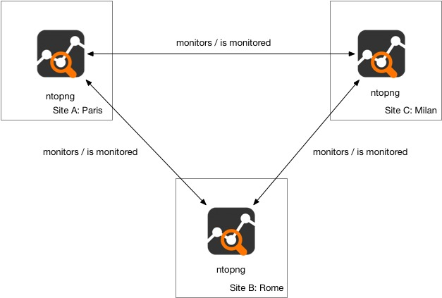
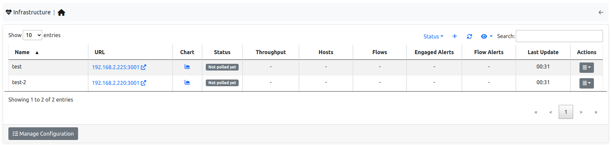
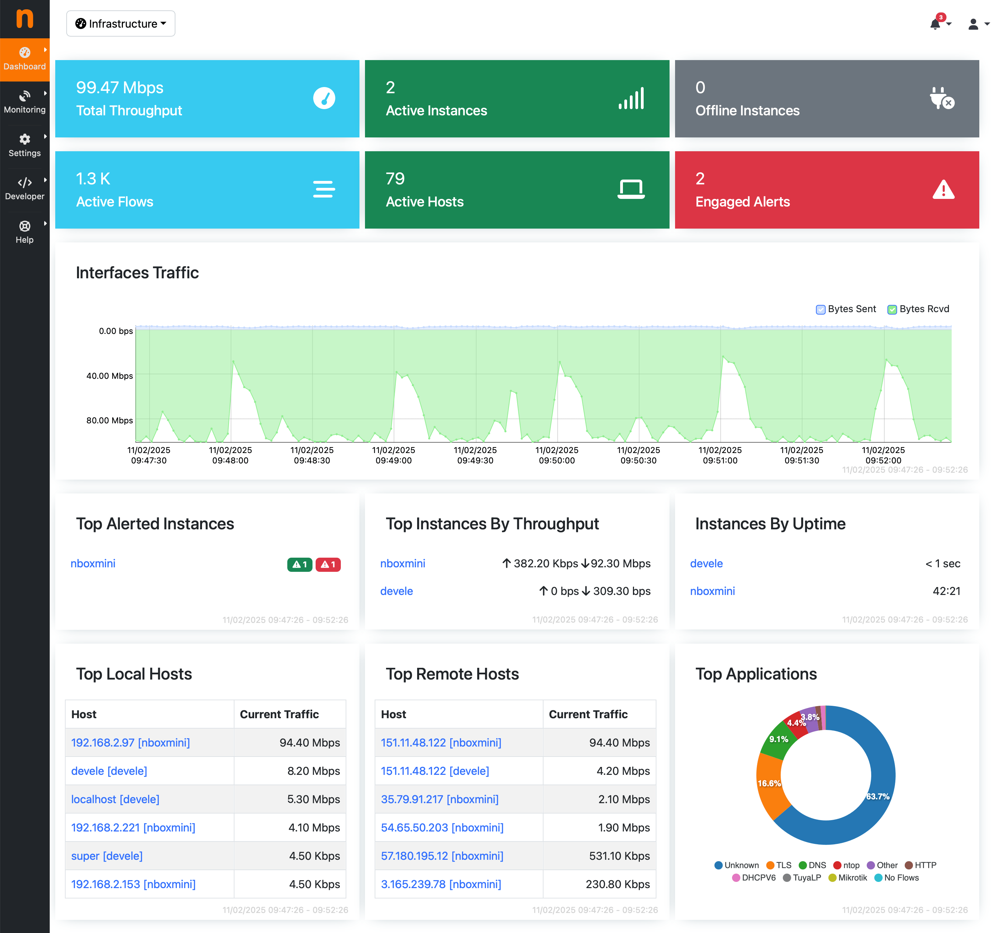

.. _InfrastructureMonitoring:
.. _UseCaseInfrastructureMonitoring:

Infrastructure Monitoring
#########################

.. note::

	An ntopng Enterprise L license or above is required.

ntopng Enterprise has the capability to monitor other ntopng instances, being them in the same local LAN or physically/geographically distributed. This capability, also referred to as *Infrastructure Monitoring*, provides live visibility of ntopng instances' status, as well as of the network interconnecting them.

Using this capability it is possible to obtain full visibility of an infrastucture with multiple running instances, having an ntopng instance continuously monitoring other instances, in a hierarchy or in a mesh topology.

For example, the following image shows the monitoring of an infrastructure with three instances, in Milan, Rome and Paris, respectively.

  Infrastructure Monitoring

To view the health and status of other ntopng instances, jump to `Monitoring -> Infrastructure`. In this page is possible to check the currently monitored instractures and add new ntopng instances to monitor.

  Infrastructure Monitoring

When monitoring other ntopng instances, ntopng shows users various information about the remote instances:

- Status: Represents the status of the remote instance (Up or Down)-
- Throughput: Represents the throughput of the remote instance.
- Hosts: Represents the number of Hosts currently active on the remote instance.
- Flows: Represents the number of Flows currently active on the remote instance.
- Enaged Alerts: Represents the number of currently enganged alerts on the remote instance.
- Flow Alerts: Represents the number of flow alerts currently on the remote instance.

It's possible add an instance to monitor by clicking the `+` symbol above the table.

.. note::

  users need the User Authentication Token of the remote ntopng to monitor the remote instance, check `here <https://www.ntop.org/guides/ntopng/advanced_features/authentication.html?highlight=token#token-based-authentication>`_.

This `blog post <https://www.ntop.org/ntopng/infrastructure-monitoring-observing-the-health-and-status-of-multiple-ntopng-instances//>`_ describes in detail this capability.

Infrastructure Dashboard
========================

Once the Infrastructure Monitorin has been configured by adding other ntopng instances to the monitored instances, a new drop-down menu appears at the top of the page. This menu, besides allowing the user to jump to other instances, includes an Infrastructure Dashboard entry. This dashboard enables users to efficiently oversee multiple regions in a unified interface while allowing granular drill-down into specific regions when needed, making it possible to:

- Monitor in real-time all ntopng instances deployed across different locations
- Monitor the total bandwidth of the entire distributed network, including traffic per application protocol
- View active alerts per region
- Identify top hosts across the entire network
- Analyze aggregated and regional performance indicators

  Infrastructure Dashboard
