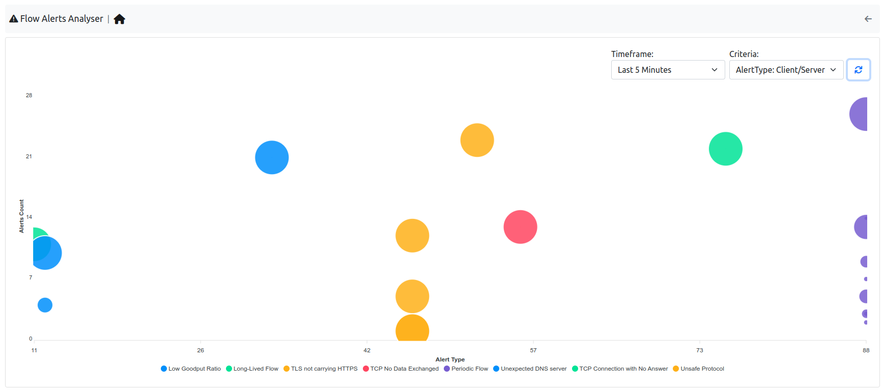
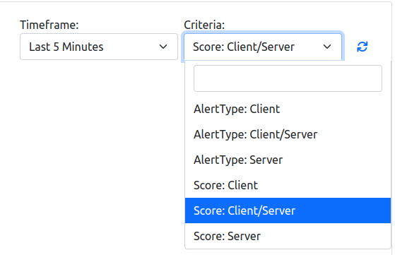
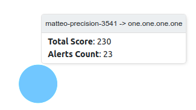

.. _FlowAlertsAnalyser:

Flow Alerts Analyser
--------------------

.. note::

  This page is available only with Enterprise license.

In this page a summary of the alerts can be seen, in order to understand as fast as possible if and where the issues are.

|

It is possible to change the view type by changing the criteria; by changing instead the timeseries entry, it can be changed the research period.

|

The X and Y axis displayes different data depending on the criteria selected (e.g. Alerts Count and Score when selecting the `Score: Client/Server`); the same goes for the tooltip on each node, if the mouse pointer stand still on a node, depending on the criteria, a different message is displayed.

|

When clicking on a node, the user is going to be redirected to the Alerts page with the corresponding filters.

