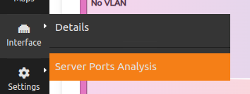
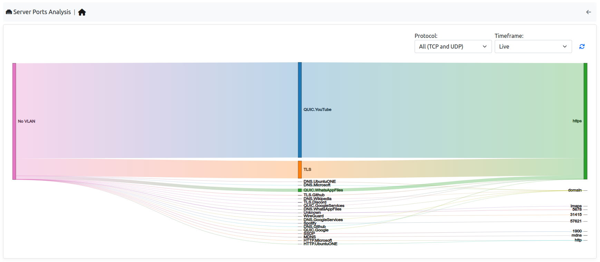

.. _ServerPorts:

Server Ports
------------

By jumping to the Server Ports entry, available in the Interface entry, it's possible to jump to this page.

.. note::
  Server Ports is available only with Enterprise L license

|

This page is used to understand which server ports are currently in use in the current Interface.

|

On the left side of the map, there are the VLANs that currently have traffic on some server ports, in the center instead the protocol can be found and on the right, the server port used.
It's possible add some filters by selecting the entries available in the right upper part of the table.
Moreover if ClickHouse is enabled, it's possible to change the timeframe and not only take a look at the live traffic but even at the historical traffic.

.. figure:: ../../../img/server_ports_analysis_filters.png
  :align: center
  :alt: Mirrore Traffic Alert

|

When clicking on the port, protocol or VLAN names available in the map, the user is going to be redirected to the requested flow page with the requested filter.

(e.g. The user click on the QUIC.Youtube protocol, the user is going to be redirected to the live traffic with QUIC.Youtube traffic; if the user was instead taking a look at historical data, the user was going to be redirected to the historical page with the selected timeframe and protocol).
