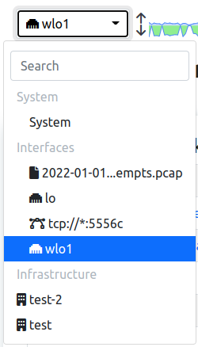

Network Interface
#################

This Web Interface is used to monitor the status of a Network Interface; there can be different types of network interfaces, see this `section`_ for more info.

  System Interface Dropdown

By changing interface and jumping to the Network Interface some options are going to be available.

.. _`section`: ../interfaces/index.html

Dashboard
---------

.. toctree::
    :maxdepth: 1

    dashboard/dashboard
    ../../flow_dump/clickhouse/reports

Monitoring
----------

.. toctree::
    :maxdepth: 2

    ../shared/monitoring/active_monitoring
    ../shared/monitoring/infrastructure_monitoring
    monitoring/network_discovery
    ../shared/snmp/index
    monitoring/vulnerability_scan

Alerts
------

.. toctree::
    :maxdepth: 2

    ../shared/alerts/alerts_explorer
    alerts/flow_alerts_analyser
    ../shared/alerts/available_endpoints

Flows
-----

.. toctree::
    :maxdepth: 2

    flows/flows
    ../../flow_dump/clickhouse/historical_flows
    flows/server_ports

Hosts
-----

.. toctree::
    :maxdepth: 2

    hosts/hosts

Maps
----

.. toctree::
    :maxdepth: 3

    maps/index

Interface
---------

.. toctree::
    :maxdepth: 2

    interface/index

Policies
---------

.. toctree::
    :maxdepth: 2

    ../shared/policies/index

