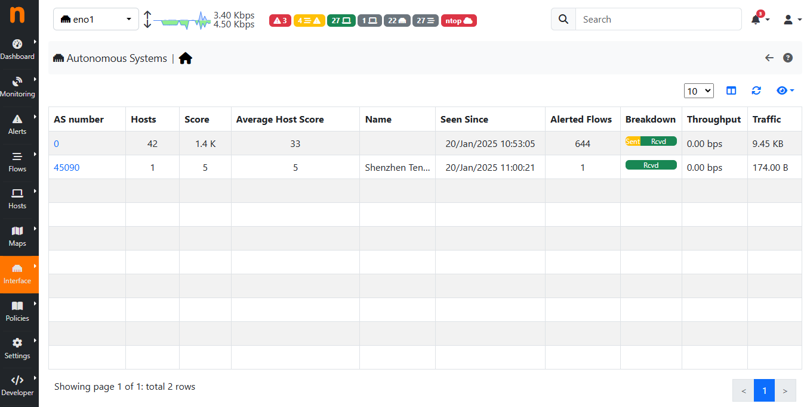

.. _AutonomouseSystems:

Autonomous Systems
------------------

Autonomous Systems shows all autonomous systems discovered by ntopng. Autonomous Systems require :ref:`Geolocation` enabled.

  The Hosts Autonomous Systems Summary Page

Ntopng uses a Maxmind database to gather information about Autonomous Systems (AS) and based on
this it groups hosts belonging to the same AS. AS number 0 contains all hosts having private IP addresses.
