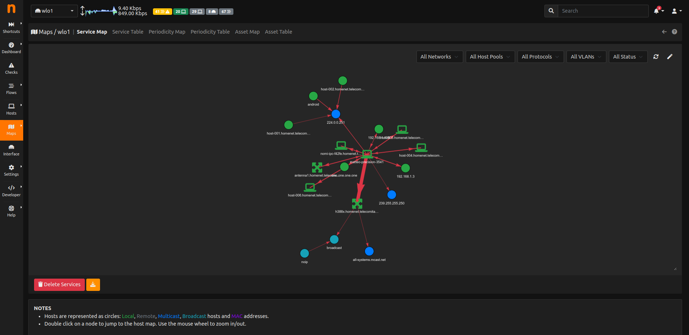
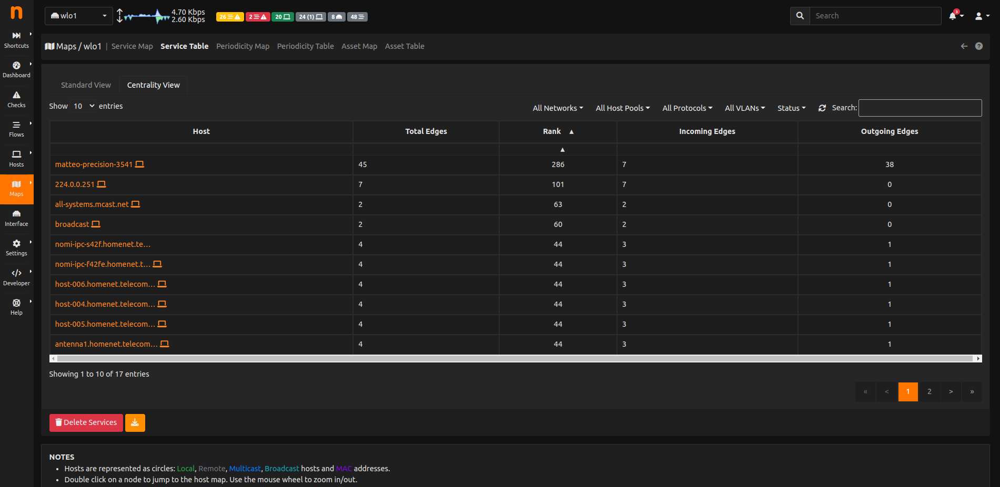

.. _AnalysisMap:

Analysis
========

These maps are accessible from the Analysis entry and there are a total of 3 types of Analysis Maps:

- Service Map
- Periodicity Map
- Asset Map

All the Maps have a graph and a table view.

Service Map
-----------
.. _Service Map:

  Service Map

The Service Map contains all the services inside a local network. Only `local hosts` are shown here. Both Periodicity Map (below) and Service Map have a table format, available by clicking the second icon, starting from the left. 
It is possible to set a learning period (changeable by preferences) and decide the default status (Authorized, Undecided or Unauthorized) for the flows that show up before and after the learning period ended.
If the `Lateral Movement` alert is enabled and the status of a service is Unauthorized, when a new flow belonging to that service shows up, then an alert is going to be triggered.

    Service Map Table
    
.. note::
    Service Map is available only with Enterprise L license

.. _`Service Map Page`: https://www.ntop.org/ntop/whats-new-in-ntopng-keep-an-eye-to-lateral-movements/

Periodicity Map
---------------
.. _Periodicity Map:

.. figure:: ../../../img/advanced_features_periodicity_map.png
  :align: center
  :alt: Periodicity Map

  Periodicity Map

The Periodicity Map contains the periodic flows of a network, with all the related information, including the frequency, the observation number and so on.

.. note::
    Periodicity Map is available only with Enterprise L license

.. _`Periodicity Map Page`: https://www.ntop.org/news/whats-new-in-ntopng-a-periodic-problem/

Asset Map
---------
.. _Asset Map:

.. figure:: ../../../img/advanced_features_asset_map.png
  :align: center
  :alt: Asset Map

  Asset Map

The Asset Map is a map containing information about services active in a network (e.g. hosts acting as DNS servers).

The services currently supported are:

  - DNS Server
  - SMTP Server
  - NTP Server
  - POP Server
  - IMAP Server

.. note::
    Asset Map is available only with Enterprise L license

.. _`Asset Map Page`: https://www.ntop.org/ntop/whats-new-in-ntopng-network-assets/
