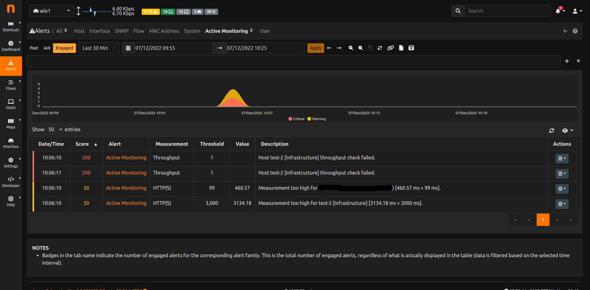

.. _Engaged Alerts:

Engaged Alerts
--------------

When the threshold is first met, ntopng puts the corresponding alert in an *engaged* state. The set of alerts 
that are currently engaged is available from the engaged alerts page identified by the hourglass icon.
This applies to all alert families, with the only exception of Flow alerts.

  Engaged Alerts Page