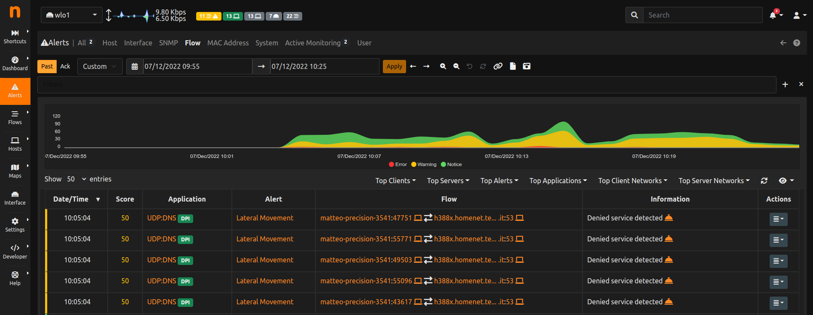

.. _FlowAlerts:

Flow Alerts
-----------

During its execution, ntopng can detect anomalous or suspicious flows for which it triggers special *flow alerts*.

Flow alerts can be detected, by means of hooks/checks, at different times (let's call them *check points*) during the flow life cycle:

- When a flow is created
- When the layer-7 application protocol is detected
- With periodic checks (e.g. every minute)
- When a flow terminates

It may happen that multiple issues are detected (by different checks) at the same check point. In this case
only the *predominant* alert (with the highest score) is triggered and stored in the database, however 
information about "secondary" issues are also stored in the same alert and displayed in the user interface. 
This happens for every check point, thus at most one alert per check point is triggered.

In short:

- In case multiple issues are detected at time *t*, a single alert is emitted (notified through the Notification
  Endpoints and inserted into the database), this alert would report the *predominant* issue and the additional 
  "secondary" issues.
- In case additional issues are detected at a later check point at time *t+1*, a new alert is emitted only if
  an issue with an higher score is detected. Note: when using Clickhouse as database, a Flow alert will always 
  report (in addition to the predominant issue) *all* the additional issues detected during the whole flow lifecycle,
  as a consequence of the way flow alerts have been implemented on Clickhouse (as a view on historical flows).
  The same does not happen when using SQLite, where all alerts, up to the time the predominant alert has been detected,
  are stored in the database, as a consequence of the way alerts are emitted.

Flow alerts not only carry the (predominant and secondary) events that caused the alert to be fired, 
they also carry all the flow details, including source and destination IP addresses, layer-7 application protocol, 
and ports.

*Flow alerts* are always associated with events and thus they are never *engaged* or *released*, they are placed 
in the past alerts directly. 

  Flow Alerts Page

Alerts that require human attention and should be manually handled (e.g. related to security issues), are also placed in the page identified by the eye icon, until they are acknowledged.

.. figure:: ../../../../img/basic_concepts_alerts_important_alerts.png
  :align: center
  :alt: Important Past Alerts Page

  Important Past Alerts Page
