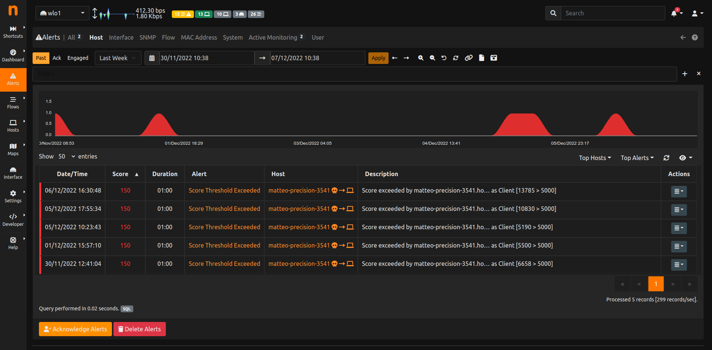

.. _PastAlerts:

Past Alerts
-----------

When the triggering threshold of an engaged alert is no longer met, the alert becomes *past* an it will no 
longer be visible in the engaged alerts page. Alerts, once released, become available from the *all* 
alerts page identified by the inbox icon, and their duration is indicated in the corresponding column. 

  All Past Alerts Page

Alerts associated with events don't have a duration associated. They are triggered *at the time of the event* 
but any duration is not meaningful for them. For this reason, such alerts are never *engaged*  or *released*, 
they are just considered *past* as soon as they are detected, and they are placed under the *all* alerts page
without any duration indicated.
