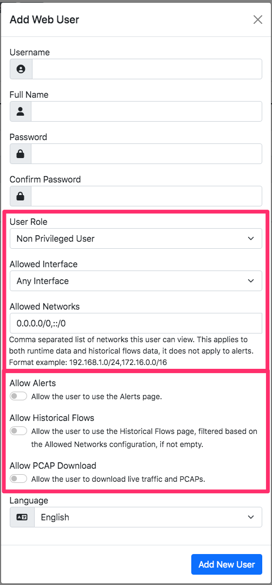

Users
=====

Users menu gives access to ntopng users administration. Ntopng is a multi-user system that
handles multiple simultaneous active sessions. Ntopng users can have the role of Administrators or
standard users.

.. figure:: ../../../img/web_gui_settings_users.png
  :align: center
  :alt: Users Settings

  The Manage Users Settings Page

Password and other preferences can be set during user creation and changed later on by clicking
on the Manage button. User preferences include:

- The user role (Administrator or Not Privileged)
- Allowed interface
- Allowed networks in traffic visualization
- Permission to download live traffic and PCAPs (honoring the interface and networks restrictions)

Multitenancy
------------

`Multitenancy <https://en.wikipedia.org/wiki/Multitenancy>`_ is the ability to monitor information coming from various users (e.g. a span port) and show to individual users only the portion of traffic that they have generated or received, hiding all the rest of the traffic.

In order to do this you need to configure users by limiting their visibility to the subset of information they should view.

You can restrict users by means of:

  - Limiting their visibility to a selected network interface
  - Restricting the visibility only to specific hosts by setting the list of subnets they can view.

This setting in the User's page these properties.

You can dive into multitenancy by reading this `blog post <https://www.ntop.org/ntopng/using-multitenancy-in-ntopng/>`_ that covers examples and describes how to configure traffic in order to use ntopng with multiple users.

