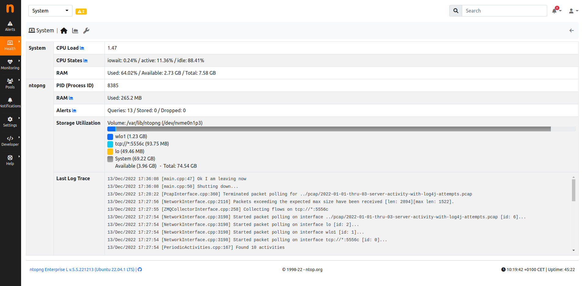

.. _Health:

Health
######

  System Interface

Like descripted in this `system section`_, the system interface is used to monitor the system on which ntopng is running.
In the Health section, users are able to monitor some core information about the system, going from the CPU/Memory usage of the system to the interfaces or Redis status.

.. toctree::
    :maxdepth: 2

    system
    interfaces
    redis
    influxdb
    clickhouse