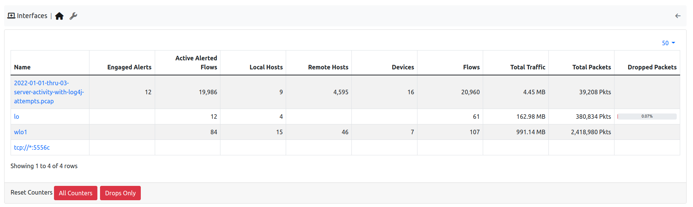

Interfaces
----------

  Interfaces Monitoring

In the Interfaces Health monitoring, the state of the interfaces analyzed by ntopng is going to be displayed, from the number of alerts, to the number of hosts, 
flows, devices, packets received and dropped.
