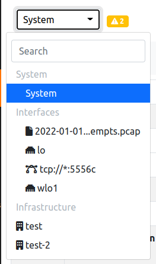

System Interface
################

The System Interface GUI is used to monitor the status of the System on which ntopng is running.

  System Interface Dropdown

By changing interface and jumping instead to the System Interface other options are going to be available.

Alerts
------

.. toctree::
    :maxdepth: 2

    ../shared/alerts/alerts_explorer
    alerts/flow_alerts_analyser
    ../shared/alerts/available_endpoints

Health
------

.. toctree::
    :maxdepth: 2

    health/system
    health/interfaces
    health/redis
    health/influxdb
    health/clickhouse

Monitoring
----------

.. toctree::
    :maxdepth: 2

    ../shared/monitoring/active_monitoring
    ../shared/monitoring/infrastructure_monitoring
    ../shared/snmp/index

Notifications
-------------

.. toctree::
    :maxdepth: 3

    ../shared/alerts/available_endpoints

Policies
---------

.. toctree::
    :maxdepth: 2

    ../shared/policies/access_control_list
    ../shared/policies/allowed_applications
    ../shared/policies/device_mac_address_tracking
    ../shared/policies/network_configuration
    ../shared/policies/traffic_rules
    ../shared/alerts/others/available_alerts
    ../shared/alerts/others/behavioural_checks_exclusion
    ../shared/policies/traffic_profiles
    

Settings
--------

.. toctree::
  :maxdepth: 2

  ../shared/settings/users
  ../shared/settings/preferences
  ../shared/settings/blacklists
  ../shared/settings/configurations
  ../shared/settings/applications_and_categories

Developer
---------

.. toctree::
  :maxdepth: 2

  ../shared/developer/rest_api
  ../shared/developer/analyze_pcap_file
  ../shared/developer/manage_data
  ../shared/developer/behavioural_checks
  ../shared/developer/alert_flow_status_definitions
  ../shared/developer/directories

Help
----

.. toctree::
  :maxdepth: 2

  ../shared/help/about
  ../shared/help/ntop_blog
  ../shared/help/report_an_issue
