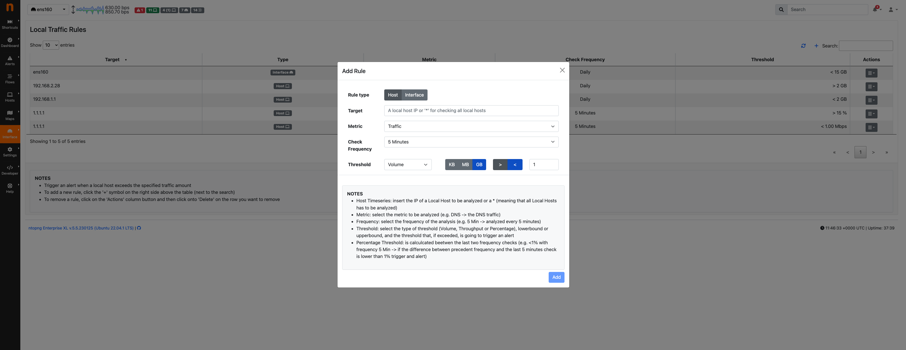

.. _Policies:

Policies
========

In the ‘Policies’ entry, various policies and rules can be configured to handle the Network, going from policies regarding Alerts (Checks) to Traffic Profiles.

Here a list of policies that can be configured:

- Access Control List: configurable set of traffic that is allowed on the machine, all the other traffic triggers an alert;
- Allowed Applications: configurable set of policies to determine which applications are acceptable for the specific device type;
- Device/MAC Address Tracking: detect devices (identified with MAC addresses) that connect to a network;
- Network Configuration: configurable set of rules to address Hosts in the local network;
- Traffic Profiles: logical aggregations of traffic, set by the user;

Access Control List
-------------------

ntopng is able to define an Access Control List, used to trigger an alert in case one of the defined rules is not respected.

.. note::

  This feature is available with Enterprise L License or better.

.. note::

  This feature is available only if the ACL Violation alert is enabled.

Configuration
^^^^^^^^^^^^^

To enable this feature, first enable the ACL Violation alert.
There are two alerts for this feature:
 - ACL Violation (ARP), for ARP traffic.
 - ACL Violation (ICMP/TCP/UDP), for ICMP/TCP/UDP traffic.

.. note::

  Even if a rule is set but the alert is not enabled, no alert is going to be emitted by ntopng.

.. figure:: ../img/acl_violation_alert.png
  :align: center
  :alt: ACL Violation alert

  ACL Violation alert

After enabling the alert, a new entry, called Access Control List, in the Settings section is going to be available, click there to jump to the Access Control List page.

.. figure:: ../img/acl_page.png
  :align: center
  :alt: Access Control List

  Access Control List

Adding Rules
^^^^^^^^^^^^

By clicking on the `+` button it is possible to Add a new Rule. By clicking on the action column instead of an already existing rule it is possible to Edit / Delete the rule.

.. figure:: ../img/add_acl_rule_modal.png
  :align: center
  :alt: Add Rule

  Add Rule

From here it is possible to configure a rule.
Click on the `Advanced Settings` to jump to a text-like field, where it is possible to directly write the rule. Each rule must be put on a newline, so one rule per line; each field must be
separated by a `;`
 - PROTOCOL;CLIENT;SERVER;PORT|APPLICATION

All parameters are mandatory except in some cases:
 - ARP protocol: in case of ARP protocol only the Protocol and Client MAC are to be added (ARP has FF:FF:FF:FF:FF:FF as Server);
 - TCP/UDP protocol: in case of these two protocols, PORT|APPLICATION are mandatory and only one of the two can be specified (application in text-like format, e.g. HTTP);
 - Other protocols: for all other protocols only the Protocol, Client IP and Server IP are required

.. note::

  PORT|APPLICATION are only available for the TCP/UDP protocols

In case of PORT|APPLICATION:
 - The application needs to be put in text-like format, e.g. HTTP, TLS, ...;
 - In case of ports, 3 possibilities are available: 
    - Configure a single port (e.g. 53);
    - Configure a port-range, set the starting port and ending port (e.g. 1-100);
    - Configure all ports to be accepted, in this case it can be done by putting the wildcard `*` or the `all` keyword (case insensitive);

It is not recommended to use the Advanced Settings if not for special cases, because in the other case all the controls are handled by ntopng.
It is moreover possible to add multiple rules in a single add, by clicking the `+` below the last rule; it is possible to remove a rule instead by clicking the trash icon.

Editing Rules
^^^^^^^^^^^^^

It is possible to edit an existing rule by clicking on the Action button and selecting `Edit`. The modal is the same as the Add, following the same rules; the only difference is that it's not possible to access the Advanced Settings feature.

.. figure:: ../img/edit_acl_rule.png
  :align: center
  :alt: Edit Rule

  Edit Rule

Delete Rules
^^^^^^^^^^^^

It is instead possible to delete rules, like for the Edit, by clicking on the Action button and selecting `Delete`. Other than that it's possible to delete all the rules by clicking on the red button `Delete All Rules` below the table.

Alert
^^^^^

After configuring everything, ntopng is going to start checking for flows not respecting the set rules and trigger the alerts;

.. figure:: ../img/acl_violation_alert_flow.png
  :align: center
  :alt: Flow Alert (ICMP/TCP/UDP)

  Flow Alert (ICMP/TCP/UDP)

.. figure:: ../img/acl_violation_alert_mac.png
  :align: center
  :alt: MAC Alert (ARP)

  MAC Alert (ARP)

Allowed Applications
--------------------

ntopng implements different techniques to automatically identify the device type
of the devices connected to a network. This includes printers, IoT and phone devices.

For each device type, ntopng provides a configurable set of policies to determine
which applications are acceptable for the specific device type. When a non-acceptable
application is detected, ntopng generates an alert. ntopng provides some built-in policies which should suit most environments.
The `Device Application Not Allowed` flow check be enabled in order to generate alerts.

Policies can be reviewed and customized in the `Device Applications` page.

.. figure:: ../img/advanced_features_device_protocols_config.png
  :align: center
  :alt: Device Protocols Configuration

  The Device Protocols Configuration Page

Each policy is split into client and server configuration. For example, in the
picture above a *Printer* can act as an HTTP server but not as an HTTP client.

When alerting is not enough, nEdge can be used to `block the new devices protocols`_
according to the configured Device Protocols policies.

.. _`block the new devices protocols`: https://www.ntop.org/guides/nedge/policies.html#device-protocols-policies

Device/MAC Address Tracking
---------------------------

ntopng is able to detect devices (identified with MAC addresses) that connect to a network. On closed networks, only certain devices can connect, and a whenever a MAC address other than those authorized explicitly is considered a threat. This in particular holds on networks such as a datacenterr or industrial IoT.

The `Unexpected Device Connected/Disconnected` alert (check `here <../alerts/interface_checks.html#unexpected-device-connected-disconnected>`_ for additional information) triggers and alert whenever an unknown MAC is detected.

.. note::

  This feature is available with at least Enterprise M License.

As described below in this page (left sidebar menu: Hosts -> Device/MAC Address Tracking), you can add a list of MAC addresses that are authorized on your network, and instruct ntopng to trigger alerts whenever:

  - An unknown MAC (i.e. a device) connects to the network
  - (Optionally) A MAC (i.e. a device) disconnects from the network

  Devices Exclusion

In this page, users can handle authorized and unauthorized MAC addresses. Whenever an unauthorized (or not accounted in the list) MAC address appears in the Interface, the corresponding alert is going to be triggered; instead it's going to not be triggered (or released) when an authorized MAC address is going to appear.

  Devices Exclusion Alert

Moreover, it is possible to configure the ability to trigger an alert when an authorized MAC address disappears from the Interface by editing the specific entry or when adding the MAC address, by enabling the `Trigger Disconnection Alert` option.

  Devices Exclusion Add Modal

Other then that, when adding a new authorized MAC address, it is possible to add a list of MAC addresses (one per row) and if an already seen MAC address is added, then, that device, is going to be set to authorized.

.. note::

  All newly added MAC addresses, using the modal, are going to be set automatically to authorized. When a MAC address not added before, using the modal, is connecting to the interface, it will be set automatically to unauthorized.

Host Policy
-----------

ntopng is able to specify an host policy for selected devices that have special requirements including restrictions on host they contact.

A typical example is a network device such as a router or switch that should not initiate any type of traffic except some rare exceptions (e.g. contact the NTP server or check for updates). When relevant network hosts perform unexpected traffic, it is very likely that something wrong happened and this behaviour needs to be detected.

.. note::

  This feature is available with Enterprise L License or better.

Configuration
^^^^^^^^^^^^^

In order to enable this feature, the 'Host Policy' behavioural check needs to be anabled.

.. figure:: ../img/host_policy_behaviour.png
  :align: center
  :alt: Host Policy Check

  Host Policy Check
  
Done this, you need to configure the host policies that are specified under Settings -> Network Configuration

.. figure:: ../img/host_policy_configuration.png
  :align: center
  :alt: Host Policy Configuration

  Host Policy Configuration
  
The configuration page allows you three type of host devices:

- Restricted Hosts (e.g. Servers, VPN servers).
- Core Hosts (e.g. Routers, Switches).
- Whitelisted Hosts: hosts that everyone can connect to (e.g. the local DNS server).

Alert Generation
^^^^^^^^^^^^^^^^
  
An 'Host Policy' critical alert is triggered whenever:

- A restricted host connects to a public IP address not whitelisted.
- A restricted host connects to a core host.
- A core host connects to any non whitelisted address.

In case an alert is generated, the exact problem detection is reported

.. figure:: ../img/host_policy_alert.png
  :align: center
  :alt: Host Policy Alert

  Host Policy Alert

Traffic Rules
-------------

ntopng can trigger customizable alerts, based on timeseries. This is useful to identify missbehaviors from devices, interfaces...

.. note::

  This feature is available only from Enterprise M license or superior.

.. figure:: ./../img/traffic_rules.png
  :align: center
  :alt: Configured Traffic Rules

  Configured Traffic Rules

Here some example of rules:
  - The daily traffic of ens160 network interfce does not have to exceed 15 GB in total;
  - The daily traffic of 192.168.2.28 does not have to be less than 2 GB in total;
  - The NTP daily traffic of 192.168.1.1 does not have to exceed 2 GB in total;
  - The 1kxun traffic every 5 minutes of 1.1.1.1 does not have to exceed 15% from the precedent 5 minutes total traffic;
  - The traffic every 5 minutes of 1.1.1.1 does not have to exceed 1 Mbps;

Whenever a condition is met, ntopng is going to trigger an alert.

.. note::
  To page is accessible from the Settings -> Traffic Rules

  
.. figure:: ./../img/traffic_rules_entry.png
  :align: center
  :alt: Access Traffic Rules

  Access Traffic Rules

Available Rules
^^^^^^^^^^^^^^^

The rules can be set for each timeseries currently available in ntopng. The rules can be configured for:

- Flow Exporters;
- Host Pools;
- Interfaces;
- Local Hosts;
- Networks;
- Traffic Profiles;
- VLANs;

Configure Rules
^^^^^^^^^^^^^^^

To add a new rule, click the '+' symbol above the table

.. figure:: ./../img/add_traffic_rule.png
  :align: center
  :alt: Add a Traffic Rule

  Add a Traffic Rule

At this point, fill the fields with the correct informations:
  - Target: insert the subject (Local Host, Interface, Subnet, ...) to be analyzed or a * , meaning that everyone has to be analyzed (e.g. All Local Hosts);
  - Metric: select the metric to be analyzed (e.g. DNS -> the DNS traffic);
  - Frequency: select the frequency of the analysis (e.g. 5 Min -> analyzed every 5 minutes)
  - Threshold: select the type of threshold (Volume, Throughput or Percentage), lowerbound or upperbound, and the threshold that, if exceeded, is going to trigger an alert
  - Percentage Threshold: is calculcated beetwen the last two frequency checks (e.g. <1% with frequency 5 Min -> if the difference between precedent frequency and the last 5 minutes check is lower than 1% trigger and alert)

.. note::
  The available metrics to be analyzed depend on the available timeseries; this means that if the Application Timeseries are not enabled from the preferences, it's not possible to configure/trigger a rule based on Applications

  Example of Traffic Rule, triggering an alert when BitTorrent traffic is seen

From now on, a new entry with the configured fields is going to be added to the table and whenever the threshold is exceeded a new alert is going to be triggered.

Edit/Delete Rules
^^^^^^^^^^^^^^^^^

It is moreover possible to edit or delete an already created rule.

To do so, click on the action button of the rule that needs changes and select the desired action:

  - :code:`Edit`: It is possible to change the rule of an already existing one; the modal is the same as the one used to add a new rule, so please refer to the above section;
  - :code:`Delete`: It is possible to remove a rule; when removed the alert is not going to be triggered anymore;

.. figure:: ./../img/delete_traffic_rule.png
  :align: center
  :alt: Remove a Traffic Rule

  Remove a Traffic Rule

.. note::
   
  Traffic rules are evaluated according to the rule frequency specified. For instance Daily rules are evaluated every midnight considering the traffic of the previous day.

Traffic Profiles
----------------

Traffic profiles allow the user to define logical aggregations of traffic. Examples of logical aggregates of
traffic include ‘TCP traffic flowing from local network 192.160.1.0/24 to host 10.0.0.1’, ‘Facebook traffic
originating at host 192.168.10.20’, and so on.

Traffic Profiles are a feature that is only available in the Professional Version of ntopng.

Profiles can be set and configured via the dropdown |cog_icon| menu in the top toolbar.

.. figure:: ../img/advanced_features_traffic_profiles_edit.png
  :align: center
  :alt: Edit Traffic Profiles

  The Edit Traffic Profiles Page

In the screenshot above, ntopng has been configured with a profile that logically includes any kind of
traffic having source and/or destination hosts within the private network 192.168.2.0/24.

Profiles must be expressed using the Berkeley Packet Filter (BPF) syntax. Filters will be parsed and syntax
will be checked every time the ‘Save Profile’ button is clicked. Errors are raised when the syntax is not BPF
compliant. A thorough discussion of the BPF falls outside the scope of this work. The interested reader cat
refer to http://biot.com/capstats/bpf.html for a detailed description of the syntax.

Realtime Profiles
^^^^^^^^^^^^^^^^^

Profiles are fine grained and potentially apply to every flow detected. Real time flows and their assigned
profiles can be seen using the ‘Flows’ menu entry in the top toolbar. Similarly, profiles can be seen on a
host basis by selecting the tab ‘Flows’ from the contextual Host Details menu.
A blue badge labelled with profile name will appear in the rightmost column ‘Info’ of every profiled flow.
In the example below are shown two currently active flows for host 192.168.2.130, that match the defined
localnet profile.

.. figure:: ../img/advanced_features_traffic_profiles_flows.png
  :align: center
  :alt: Active Flows Traffic Profiles

  Traffic Profiles in the Active Flows Page

Historical Profiles Statistics
^^^^^^^^^^^^^^^^^^^^^^^^^^^^^^

Profiles are not only available in realtime. Their traffic statistics are sampled every minute and stored in
RRDs. Similarly, if ntopng was started with the -F modifier, flows will be exported to MySQL or ElasticSearch
together with their profiles. Historical charts and tables are available in the ‘Profile Details’ page,
reachable from the ‘Interface’ contextual toolbar. By clicking on the doctor ! icon, it is possible to see the
full list of profiles detected for the selected interface, together with their traffic and throughput trend. Profile
Details page can be opened for each profile simply by clicking on the |chart_icon| icon.

.. figure:: ../img/advanced_features_traffic_profiles_summary.png
  :align: center
  :alt: Traffic Profiles Summary

  The Traffic Profiles Summary Page

Profile Details page shows historical profile traffic. An optional table with historical flow details — for flows
matching the selected profile — is shown below the chart if ntopng was started with the -F modifier.

.. figure:: ../img/advanced_features_traffic_profiles_details.png
  :align: center
  :alt: Traffic Profiles Details

  The Traffic Profile Details Page

.. warning::
  Presently, no overlapping profiles are handled. This means that when a flow matches more than
  one traffic profile, it will be assigned to one profile only in a non-predictable way.

.. |cog_icon| image:: ../img/cog_icon.png
.. |chart_icon| image:: ../img/chart_icon.png
